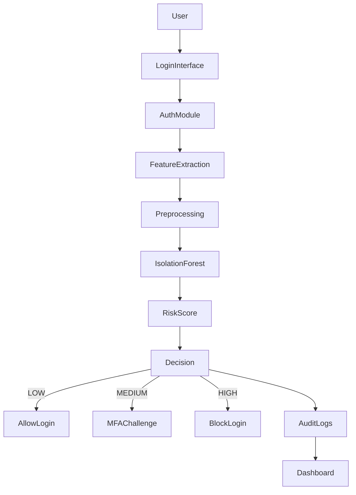

# AI-Based Risk-Adaptive Secure Authentication System

## Project Title
AI-Based Risk-Adaptive Secure Authentication System

## Problem Statement
Traditional username-password authentication is vulnerable to suspicious login behavior such as new devices, unusual IP addresses, repeated failed attempts, and abnormal login timing. In many real systems, these conditions are not considered during login decisions. This project demonstrates how AI-based anomaly detection can classify authentication risk and adaptively enforce stronger security measures such as MFA or blocking.

## Objectives
- Build a working secure authentication system using Flask, SQLite, and SQLAlchemy.
- Use an Isolation Forest model to detect suspicious login behavior.
- Enforce password hashing, rate limiting, lockout, and MFA.
- Record security events in audit logs and visualize them on a dashboard.
- Provide a simple demo environment for normal, medium-risk, and high-risk scenarios.

## Technologies / Tools Used
- Python 3.11+
- Flask
- SQLite
- SQLAlchemy
- bcrypt / passlib
- PyJWT
- PyOTP
- Flask-Limiter
- Flask-Talisman
- scikit-learn (Isolation Forest)
- NumPy and pandas
- HTML, CSS, JavaScript

## System / Module Design
The system follows a simple layered architecture:



## AI/ML Methodology
The project uses an Isolation Forest model trained on synthetic normal login behavior. The model learns typical login patterns based on:
- login hour
- failed-attempt count
- recent login activity
- new IP flag
- new device/browser flag
- time since previous login

The model produces an anomaly score, which is transformed into a risk score between 0 and 100. The risk is then classified as:
- LOW: 0-39
- MEDIUM: 40-69
- HIGH: 70-100

The final decision is:
- LOW → allow login
- MEDIUM → require MFA
- HIGH → block login

## Features
- Secure password storage with bcrypt
- User registration and validation
- JWT-based session handling
- Rate limiting on login and sensitive routes
- Failed login tracking and temporary lockout
- MFA using TOTP
- AI-based risk assessment using Isolation Forest
- Audit logs for every relevant authentication event
- Dashboard with summary and recent security events

## Authentication Flow
1. User submits username/email and password.
2. Input validation and rate-limit checks are enforced.
3. Password is verified securely.
4. Login metadata is collected from the request.
5. AI engine evaluates risk using login behavior features.
6. Risk is classified as LOW, MEDIUM, or HIGH.
7. The system either allows the login, requires MFA, or blocks the attempt.
8. Audit logs are recorded for every outcome.

## Security Mechanisms
- Password hashing using bcrypt
- Generic login failure responses
- Rate limiting per IP address
- Failed attempt tracking and lockout
- MFA for medium-risk logins
- Secure HTTP headers with Flask-Talisman
- JWT tokens for authenticated sessions
- Audit logging without storing sensitive plaintext data

## Installation
```bash
cd "c:\Users\Ebinesh\OneDrive\Desktop\Nah Nah\crypto_secure_authentication_cia_3"
python -m venv .venv
.venv\Scripts\activate
python -m pip install --upgrade pip
pip install -r requirements.txt
python -m flask --app app init-db
```

## How to Run
```bash
cd "c:\Users\Ebinesh\OneDrive\Desktop\Nah Nah\crypto_secure_authentication_cia_3"
.venv\Scripts\activate
python app.py
```
Then open: http://127.0.0.1:5000/login

## Demo Credentials
- Username: demo
- Password: Demo@123

## Demonstration Scenarios
### Scenario 1: Normal Login
- Log in with the demo user using a standard time and normal behavior.
- Expected result: LOW risk, login allowed.

### Scenario 2: Suspicious Login
- Use the login page demo selector for medium risk or simulate unusual login timing, new IP, and new device behavior.
- Expected result: MEDIUM risk, MFA required.

### Scenario 3: High-Risk Login
- Use the high-risk demo mode or trigger repeated failed attempts.
- Expected result: HIGH risk, login blocked and event recorded.

## Expected Results
- Normal logins should pass without extra challenges.
- medium-risk logins should request MFA.
- high-risk attempts should be blocked and logged.
- Dashboard should show counts, recent events, and risk summaries.

## Limitations
- The project uses synthetic training data rather than real-world telemetry.
- The AI engine is a lightweight educational model, not a production-grade threat detection system.
- This project is intentionally designed for a college-level demonstration.

## Future Enhancements
- Add a more advanced real-time feature pipeline.
- Use more behavioral features such as geolocation and device fingerprinting.
- Add role-based access control.
- Improve anomaly scoring with richer historical data.

## Conclusion
This project presents a practical, simple, and academically suitable implementation of AI-based adaptive authentication. It demonstrates how machine learning can complement traditional login systems by adding behavioral analysis, risk classification, and step-up verification.

## Individual Contribution
Student contribution: design and implementation of the secure authentication system, AI risk model, MFA flow, and dashboard.

## References
1. scikit-learn: Isolation Forest documentation.
2. Flask documentation for app security and sessions.
3. PyOTP documentation for TOTP-based MFA.
4. OWASP authentication guidance.

## Report Content Summary
The repository also includes a concise academic report content file titled `report-content.md` for the college submission.
